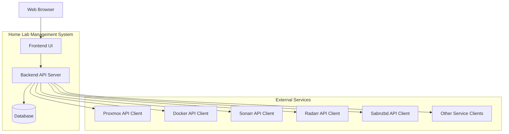

# Home Lab Management Application Architecture

## Overview

This document outlines the architecture for a web-based home lab management application that provides centralized monitoring and control of various services including Proxmox virtual machines, Docker containers, and media management applications (Sonarr, Radarr, Sabnzbd).

## High-Level Architecture Diagram

## System Components

### Frontend Components

- **Dashboard UI**: Main interface displaying all monitored services and applications
- **Service Management Panel**: Controls for Proxmox VMs and Docker containers
- **Application Management Panel**: Controls for Sonarr, Radarr, Sabnzbd and other applications
- **Configuration Interface**: Settings management for the application itself
- **Authentication/Authorization**: User login and role-based access control
- **Real-time Monitoring Widgets**: Status displays with live updates

### Backend Components

- **API Server**: RESTful/GraphQL API handling all frontend requests
- **Service Adapters**: Modular components for interfacing with external services
- **Authentication Service**: User management and session handling
- **Configuration Service**: Management of application settings and user preferences
- **Notification Service**: Alerting system for service status changes
- **Scheduler Service**: Background tasks for periodic monitoring and maintenance

## External Service Integration Strategy

### Proxmox Integration
- Use Proxmox REST API for VM monitoring and control
- Authentication via API tokens or credentials
- Key operations: start/stop VMs, get status, list VMs, monitor resources

### Docker Integration
- Use Docker Engine API or Docker SDK
- Remote Docker daemon connection via SSH or API endpoints
- Container lifecycle management: start/stop/restart containers
- Image management and resource monitoring

### Sonarr/Radarr Integration
- Use their respective REST APIs
- Monitor download queues, library status, and health
- Control operations: pause/resume queues, trigger searches, manage content

### Sabnzbd Integration
- Use Sabnzbd API for download management
- Monitor active downloads, queue status, and completion statistics
- Control operations: pause/resume downloads, modify queue priorities

## Data Storage Plan

### Configuration Data
- **User Settings**: Dashboard layouts, theme preferences, notification settings
- **Service Endpoints**: API URLs, credentials (encrypted), connection settings
- **Application Preferences**: Custom categories, grouping rules, monitoring thresholds

### Storage Strategy
- **SQLite**: Lightweight database for configuration and user settings
- **Encrypted Storage**: API credentials and sensitive data
- **File-based Backup**: Configuration files that can be easily version controlled

## Technology Stack Proposal

### Frontend
- **React.js**: Modern component-based UI framework
- **TypeScript**: Strong typing for maintainable code
- **Tailwind CSS**: Utility-first CSS framework for rapid UI development
- **React Query**: Efficient data fetching and state management
- **Socket.io**: Real-time communication for live updates

### Backend
- **Node.js**: JavaScript runtime for building scalable server applications
- **Express.js**: Web framework for RESTful API development
- **TypeScript**: Strong typing for backend code consistency
- **SQLite**: Lightweight, file-based database for configuration storage
- **Axios**: HTTP client for external API communications

### Additional Components
- **Docker**: Containerization for easy deployment
- **PM2**: Process management for Node.js applications
- **Authentication**: JWT tokens for secure session management

We will rely on reverse proxy for SSL termination. We should be able to support a prefix like /homie in teh revese proxy.

### Justification
- **React/TypeScript**: Widely adopted, strong ecosystem, good developer experience
- **Node.js/Express**: Familiar technology stack that integrates well with frontend
- **SQLite**: Simple, no additional database server required, perfect for home lab use
- **Docker-based deployment**: Easy setup and management in home lab environments. Ideally we would have a single docker container. 